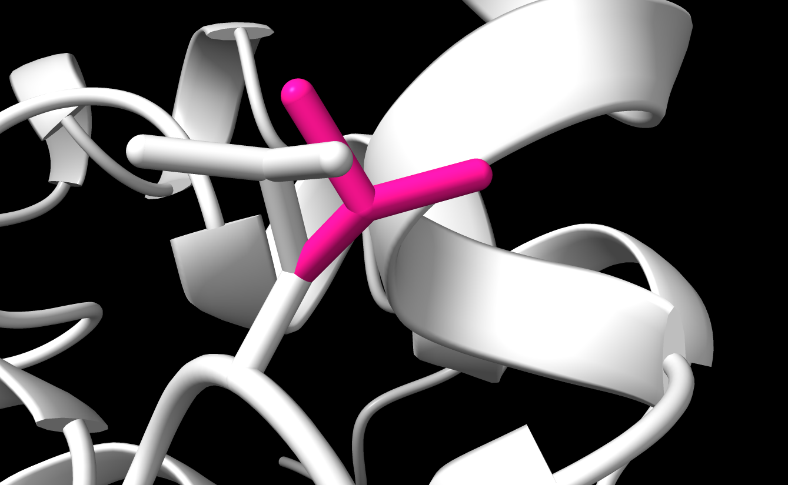

# AAPerturb
A C++ library for the creation of a large dataset of amino acid sidechain perturbations, own PDB Parser code included and some other things related as partly described in [Pre-training of Graph Neural Network for Modeling Effects of Mutations on Protein-Protein Binding Affinity](https://arxiv.org/abs/2008.12473).

The approach described in the paper consists of perturbing a sidechain and trying to reconstruct the original sidechain via an autoencoder.


## PDB Parser
It has an own PDB parser which is mostly educational/for myself as there is probably something available that does this.

The proteins are basically represented as a map chainID -> Vector of Residues, where the Residues contain the atoms.
A particular reason I implemented this myself, is that most libraries that are available in python overcomplexify the task of parsing PDBs,
introducing weird classes with crazy functionality that is useful in many cases but in my case I just want to do geometric transormations on simple ATOM records.

For some of the implementations refer to Biopython, rdkit, and the really useful Biopandas.


## Geometrical operations

There are different ways to implement rotations, translations and calculations of distances for molecules.
Although it would have been more efficient to work with matrices of atomic coordinates, this would mean to keep track of exactly how those matrices are ordered in terms of atoms and residues.
So to keep it simple, and bookkeeping reasons I decided to work with single coordinates of the atoms. Each split into residues and chains.

Rotating around bonds is a well described [problem](https://sites.google.com/site/glennmurray/glenn-murray-ph-d/rotation-matrices-and-formulas/rotation-about-an-arbitrary-axis-in-3-dimensions), for which you have to use the rotation matrix found at the previous link.

## Random Perturbations

The main goal of the package is to perform random perturbations the sidechain of a random amino acid, this amino acid should reside
on the interface between two chains of the protein-protein complex.
The created data set can be used after for an autoencoder-like machine learning approach to capture PPI's and effects of mutations proteins.

The execution flow is as follows:
1. Find interface residues on the PP complex, given a cutoff value
2. Choose random interface residue
3. Perturb chosen residue

For now this perturbation is just torsion about the sidechain axes which could in theory freely rotate.
In my head the only condition for acceptance of a conformation after a perturbation, is that there are no clashes between atoms.
It is also possible to sample the perturbation \Chi angles from physically relevant distributions as defined for example in [Dunbrack (2011)](http://dunbrack.fccc.edu/lab/bbdep2010).


Finally, to be specific about what I would like to implement in the near future, as some extra functionality.
Just like in these geometrical transformations are perturbations, we can look at mutations in the same way. While the concept proposed in the first mentioned paper is to recreate atomic coordinates after a perturbation, a similar operation could be used in an alchemical way, recreating both coordinates, and adding atoms/graph nodes to a molecular graph, with the goal to reduce its strain/energy or recreate the original structure.
In principle this could be used to predict the probability of certain mutations, which is obviously something cool and useful.

An example of such a random perturbation can be seen in the next picture.



## Requirements

The library was built using C++23, with g++ and gcc version 13.
To build it clone this project and inside the project directory:


```
git submodule update --init --recursive

mkdir build
cd build
cmake -DCMAKE_INSTALL_PREFIX="PATH TO YOUR PREFERRED INSTALL DIR" ..
make -jN aaperturb install 

```

## Cleaning of PDB files.

To produce output that is useful, a preprocessing step may be required, which deals with removal of waters, deprotonation, removal of alternate locations, removal of insertions and reindexing atoms and residues.
This is crucial to the main program to run without bugs and random errors, and also the less atoms there are the less expensive calculations get.
The residue numbering has to start in each chain at 1.
The part of cleaning the PDBs seemed easier to do with python with the already available PandasPDB package. The script is located at scripts/pdbcleaner.py.
It needs following packages: biopandas, pandas, numpy, alive_progress
You can run it as follows:
```
python pdbcleaner.py -i [INPUT_DIR/FILE] -o [OUTPUT_DIR/FILE]
```

It is going to clean all the files and save them. Specifying the input dir to be the same as the output dir is prohibited due to the safety of your dataset.

## Running AAPerturb

```
aaperturb -i [STR] -o [STR] --max-bbangle [FLOAT] --max-schangle [FLOAT] 
```

You have to provide an input directory (where the cleaned PDB's are at), and an output directory. The last two arguments are how big of a torsion we allow on the backbone and the sidechains. Youd should choose small angles less than 20. This is because for small angles it is safe to assume that there are no clashes after perturbation, that is, we don't have to claculate distances between atoms and everything runs a lot faster.


#### Note 1

Of course you may want the perturbations to be "realistic" like the mentioned paper did. They took a shurtcut and used FoldX (which uses the Dunbrack rotamers) to mutate/perturb residues as it seems. Given you have the torsion angle distributions from the Dunbrack library you can straightforwardly use them instead the uniform distribution that I did. Currently I use the appropriate experimental Chi1 and Chi2 angles, but for the other torsions I use an approximation of small perturbations.

Of course this means that you have to be more careful about clashes, and also introduce some other stuff into the code.

#### Note 2

No one has actually tested if small perturbations work as well as the rotamers, which I am working on currently using a structural autoencoder.


